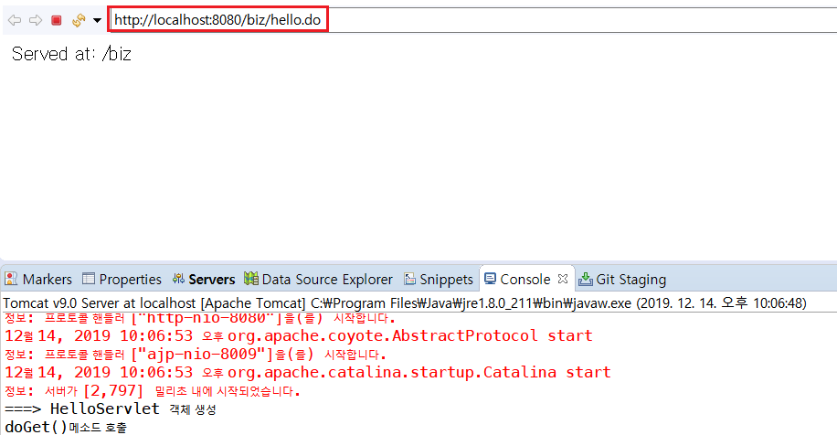
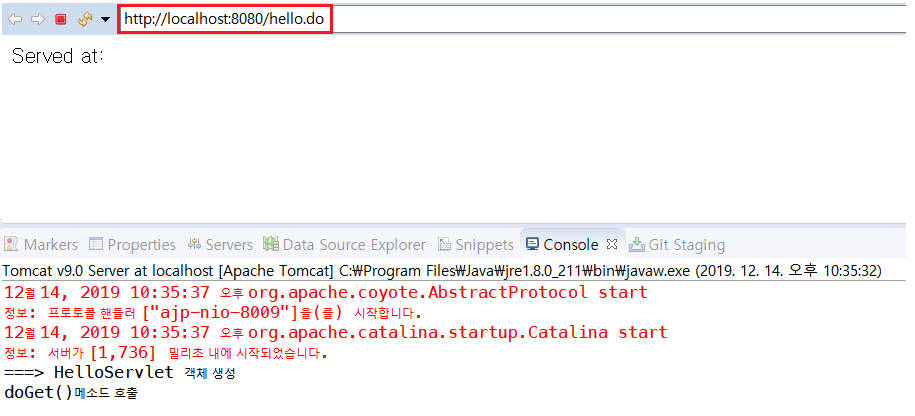
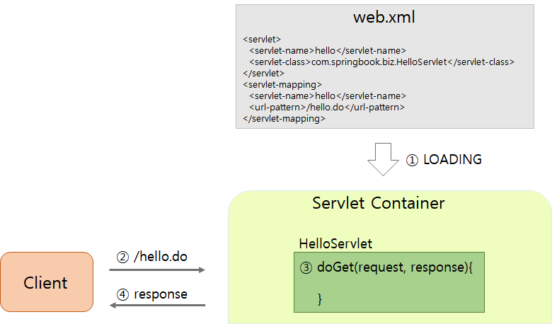

# IoC (Inversion of Control)

## 1. IoC와 결합도

### IoC 이전

자바 기반의 애플리케이션을 개발할 때, 객체를 생성하고 객체들 사이의 의존관계를 처리하는 것에 대한 책임은 전적으로 개발자에게 있었다. 즉, 개발자가 어떤 객체를 생성할지 판단하고 객체 간의 의존관계 역시 소스코드로 표현해야 했다. 

<br>

### IoC 이후

기존에 개발자가 처리해왔던 작업(어떤 객체를 생성할지 판단하고 객체 간의 의존관계를 소스코드로 표현하는 일)을 컨테이너가 대신 처리하는 것을 의미한다. **따라서 제어의 역행을 이용하면 소스에서 객체 생성과 의존관계에 대한 코드가 사라져 결과적으로 낮은 결합도의 컴포넌트(클래스)를 구현할 수 있게 된다.**

=> 스프링 프레임워크의 가장 중요한 특징은 객체의 생성과 의존관계를 컨테이너가 자동으로 관리한다는 점이다. 이것이 바로 IoC의 핵심 원리이다

<br>

<br>

## 2. Servlet 컨테이너

> 컨테이너 개념을 스프링에서 처음 사용된 것을 아니며, 기존의 서블릿이나 EJB 기술에서 이미 사용해왔다.
>
> 그리고 대부분의 컨테이너는 비슷한 구조와 동작 방식을 가지고 있으므로 서블릿 컨테이너를 통해 스프링 컨테이너의 동작 방식을 유추해보자

<br>

### 2.1 Servlet 생성

- Servlet은 Not POJO 클래스 - Servlet이 요구하는 규칙에 맞게 클래스 작성

  - **public** 클래스로 선언
  - Servlet, GenericServlet, **HttpServlet** 중 하나를 상속
  - **기본생성자**
  - 생명주기에 해당하는 메소드 오버라이딩

  <br>

  ```java
  // HelloServlet.java
  
  package com.springbook.biz;
  
  ...
      
  public class HelloServlet extends HttpServlet {
  	private static final long serialVersionUID = 1L;
  
      public HelloServlet() {
          super();
          System.out.println("===> HelloServlet 객체 생성");
      }
  
  	protected void doGet(HttpServletRequest request, HttpServletResponse response) throws ServletException, IOException {
  		System.out.println("doGet()메소드 호출");
  		response.getWriter().append("Served at: ").append(request.getContextPath());
  	}
  
  	protected void doPost(HttpServletRequest request, HttpServletResponse response) throws ServletException, IOException {
  		// TODO Auto-generated method stub
  		doGet(request, response);
  	}
  
  }
  ```

  <br>

  <br>

### 2.2 web.xml

- 이클립스를 이용해 서블릿 클래스 생성시, 작성된 Servlet 클래스는 `web.xml` 파일에 자동으로 등록

  - `<servlet-name>` 만 맞춰주면 서블릿명 바꿔도 상관없음

  <br>

  ```java
  // webapp/WEB-INF/web.xml
  
  <servlet>
    <display-name>HelloServlet</display-name>
    <servlet-name>hello</servlet-name>
    <servlet-class>com.springbook.biz.HelloServlet</servlet-class>
  </servlet>
  <servlet-mapping>
    <servlet-name>hello</servlet-name>
    <url-pattern>/hello.do</url-pattern>
  </servlet-mapping>
  ```

  <br>

- 실행

  1. 브라우저에서 `hello.do`라는 URL 요청을 전송

  2.  `hello`라는 이름으로 등록된 `base_package.HelloServlet` 클래스를 찾아 **객체를 생성하고 실행**

     => [누가 서블릿 객체를 생성하고, doGet() 메소드를 호출해줬을까?](#3.-서블릿-컨테이너가-servlet-클래스-객체를-관리하는-방법)

  <br>

  

  <br>

- url에서 **biz(context url)** 생략하고 싶으면 `servel.xml` 에 path 수정

  ```java
  <Context docBase="BoardWeb" path="/" reloadable="true" source="org.eclipse.jst.jee.server:BoardWeb"/>
  ```

  <br>

  

<br>

<br>

## 3. 서블릿 컨테이너가 servlet 클래스 객체를 관리하는 방법

> 서블릿은 자바로 만들어진 클래스이다.
>
> 따라서 반드시 객체 생성을 해야 객체가 가지고 있는 메소드도 호출할 수 있다.
>
> 하지만 HelloServlet 에서는 객체 생성코드나 doGet() 메소드 호출을 확인할 수 없다.
>
> 왜냐하면 서블릿 컨테이너가 서블릿 객체를 생성하고, doGet() 메소드를 호출해주었기 때문이다!

<br>

- 서블릿 컨테이너가 Servlet 클래스 객체를 생성하고 운용하는 과정

  

<br>

1. WEB-INF/web.xml 파일을 로딩하여 구동
2. 브라우저로부터 /hello.do 요청 수신
3. `base_package.HelloServlet` 클래스를 찾아 객체를 생성하고 `doGet()` 메소드 호출
4. `doGet()` 메소드 실행 결과를 클라이언트 브라우저로 전송

<br>

컨테이너는 자신이 관리할 클래스들이 등록된 XML 설정 파일(web.xml) 을 로딩하여 구동한다. 그리고 클라이언트의 요청이 들어오면 XML설정 파일을 참조하여 객체를 생성하고, 객체의 생명주기를 관리한다.

<br>

<br>

<br>

## 4. 스프링의 의존성 관리 방법

 스프링은 IoC를 다음 두 가지 형태로 지원한다.

- Dependency Lookup
- Dependency Injection