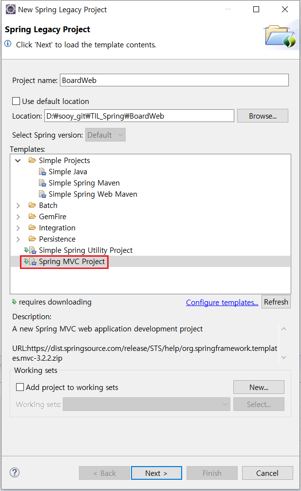

# Spring Project

## 1. 프로젝트 생성

### 1. 스프링 기반의 웹 프로젝트 생성

- [File] -> [New] -> [Spring Legacy Project]

  - **Spring MVC Project** 선택

     
    
    

 

 

- 패키지 지정

  - 패키지 경로에 최소 세 개 이상의 패키지가 지정되어야 프로젝트 생성 가능

     

    