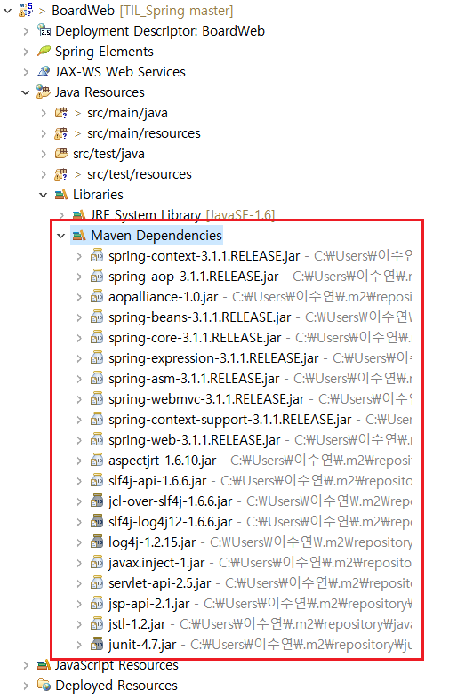

# 스프링 프레임워크의 특징

> IoC와 AOP를 지원하는 경량의 컨테이너 프레임워크

 

## 1. 경량 (Lightweight)

- 스프링은 크기 측면에서 가볍다

  - 여러 개의 모듈로 구성되어 있고, 각 모듈은 하나 이상의 JAR파일로 구성되어 있다

  - 이 몇개의 JAR 파일만 있으면 개발과 실행이 모두 가능하다

    => 따라서 스프링을 이용해서 만든 애플리케이션의 배포 역시 매우 빠르고 쉽다
    
  - 스프링 기반 웹 애플리케이션 개발에 필요한 라이브러리들
  
     
  
    > 
  

 

 

 

## 2. IoC (Inversion of Control)

> 제어의 역행
>
> 제어권이 프레임워크에 있다

 

