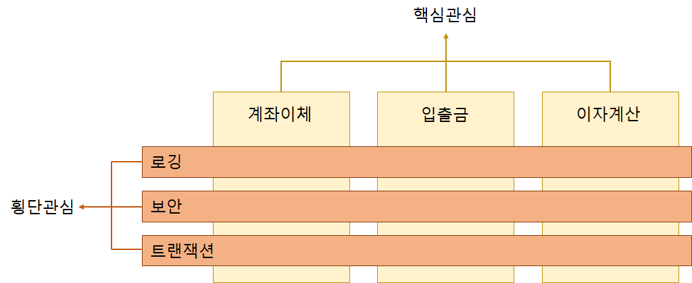

# 스프링 프레임워크의 특징

> IoC와 AOP를 지원하는 경량의 컨테이너 프레임워크

 

## 1. 경량 (Lightweight)

- 스프링은 크기 측면에서 가볍다

  - 여러 개의 모듈로 구성되어 있고, 각 모듈은 하나 이상의 JAR파일로 구성되어 있다

  - 이 몇개의 JAR 파일만 있으면 개발과 실행이 모두 가능하다

    => 따라서 스프링을 이용해서 만든 애플리케이션의 배포 역시 매우 빠르고 쉽다
    
  - 스프링 기반 웹 애플리케이션 개발에 필요한 라이브러리들
  
     
  
    > 
  

 

 

 

## 2. IoC (Inversion of Control)

> 제어의 역행
>
> 제어권이 프레임워크에 있다
>
> 결합도 관련 : 코드의 의존관계

 

- 스프링은 IoC를 통해 애플리케이셔을 구성하는 객체 간의 느슨한 결합, 즉 낮은 결합도를 유지한다

- IoC 적용 이전

  - 애플리케이션 수행에 필요한 **객체의 생성**이나 **객체와 객체 사이의 의존관계**를 개발자가 자바 코드로 처리 => 의존관계에 있는 객체를 변경할 때, 반드시 자바 코드를 수정해야 함

- IoC 적용 이후

  - 객체 생성과 의존관계 모두 개발자가 자바 코드로 처리하는 것이 아니라 **컨테이너**가 처리

    => 소스에 의존관계가 명시되지 않으므로 결합도가 떨어져서 유지보수가 편해짐

 

 

 

## 3. AOP (Aspect Oriented Programming)

> 관점지향 프로그래밍
>
> **비즈니스 메소드 개발시, 핵심 비즈니스 로직과 각 비즈니스 메소드마다 반복해서 등장하는 공통 로직을 분리함으로써 응집도가 높게 개발할 수 있도록 지원한다**
>
> AOP 참고문서1 :  http://wiki.gurubee.net/pages/viewpage.action?pageId=26740833
>
> AOP 참고문서2 - AOP설명  & 용어 : <https://jojoldu.tistory.com/71>

 

### 횡단관심 vs 핵심관심

횡단관심 : 메소드마다 공통적으로 등장하는 로깅, 보안, 트랜젝션과 같은 코드들

핵심관심 : 사용자의 요청에 따라 실제로 수행되는 핵심 비즈니스 로직

=> ***AOP는 횡단관심과 핵심관심을 분리하는 것!***

 

 

- 공통으로 사용하는 기능들을 외부의 독립된 클래스로 분리한다

- 분리한 기능을 프로그램 코드에 직접 명시하지 않고 선언적으로 처리하여 적용하는 것이 관점지향 프로그래밍

- 공통 기능을 분리하여 관리할 수 있으므로

  => **응집도가 높은 비즈니스 컴포넌트**를 만들 수 있고

  => **유지보수 향상** 

 

[응집도가 높다는 말은 무슨 뜻일까..?](#결합도-vs-응집도)

 

 

 

## 4. 컨테이너

> 객체의 생성과 관리를 담덩
>
> 객체 운용에 필요한 다양한 기능을 제공

 

- 컨테이너는 일반적으로 서버 안에 포함되어 배포 및 구동된다
- 대표적인 컨테이너로 Servlet 컨테이너와 EJB 컨테이너가 있다
- 애플리케이션 운용에 필요한 객체를 생성하고 객체 간의 의존관계를 관리한다는 점에서 스프링도 일종의 컨테이너라고 할 수 있다

 

 

 

# 결합도 vs 응집도

>결합도(Coupling) 과 응집도(Cohesion)
>
>소프트웨어 공학의 전동적인 이론에 따르면, 유지보수성이 높은 소프트웨어는 프로그램의 각 요소들이 결합도는 낮게, 응집도는 높게 구성되어야한다

 

### 결합도(Coupling)

